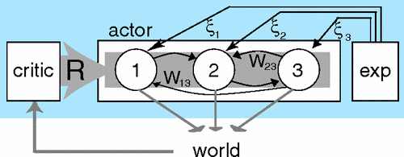

# biornn

PyTorch implementation of the [Fiete & Seung, 2006](https://journals.aps.org/prl/abstract/10.1103/PhysRevLett.97.048104) node perturbation method for training a rate-based recurrent neural network with self-connected hidden layers (Elman RNN) on a [name classification task](https://pytorch.org/tutorials/intermediate/char_rnn_classification_tutorial.html).

